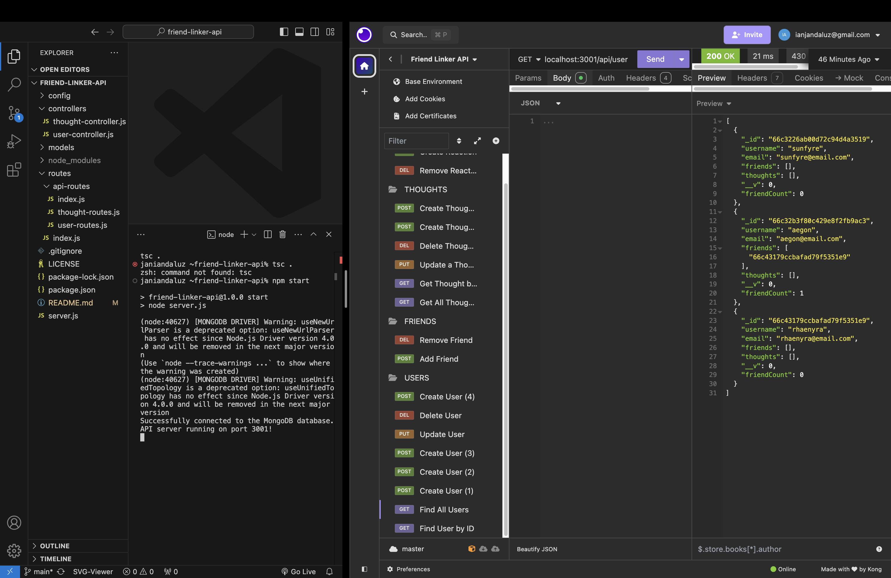

# Friend Linker API

[](https://github.com/Thecaprifire)
[](https://choosealicense.com/licenses/mit/)
  
  
## Description:
The Friend Linker API is a robust backend solution for a social network web application, enabling users to share thoughts, react to friends’ posts, and manage their friend list. Built with Express.js for routing, MongoDB for the database, and Mongoose as the ODM (Object Data Modeling) tool, this API supports seamless CRUD operations on users, thoughts, reactions, and friend relationships.

This project addresses a NoSQL challenge by creating a flexible, scalable API designed to handle extensive unstructured data, typical for social media platforms.


 ## Table of Contents
  * [Description](#description)
  * [The Challenge](#the-challenge)
  * [User Story](#user-story)
  * [Acceptance Criteria](#acceptance-criteria)
  * [Installation Process](#installation-process)
  * [Walkthrough Video](#walkthrough-video)
  * [Screenshots](#screenshots)
  * [Resources](#resources)
  * [Questions](#questions)
  * [License](#license)


## The Challenge:
The goal was to develop a RESTful API to manage users, thoughts, and reactions through CRUD operations using a NoSQL database. Built with Node.js and Mongoose, the API features endpoints that efficiently handle large volumes of unstructured data.

Key functionalities include:

	•	Creating and deleting user accounts.
	•	Performing CRUD operations on thoughts.
	•	Adding and removing reactions to thoughts.
	•	Managing friendships by adding or removing friends.

To test the API, use Insomnia or a similar tool to send HTTP requests to the endpoints and verify the accuracy of responses.


## User Story
```md
AS A social media startup
I WANT an API for my social network that uses a NoSQL database
SO THAT my website can handle large amounts of unstructured data
```


## Acceptance Criteria
```md
GIVEN a social network API
WHEN I enter the command to invoke the application
THEN my server is started and the Mongoose models are synced to the MongoDB database
WHEN I open API GET routes in Insomnia for users and thoughts
THEN the data for each of these routes is displayed in a formatted JSON
WHEN I test API POST, PUT, and DELETE routes in Insomnia
THEN I am able to successfully create, update, and delete users and thoughts in my database
WHEN I test API POST and DELETE routes in Insomnia
THEN I am able to successfully create and delete reactions to thoughts and add and remove friends to a user’s friend list
```


## Installation Process
1.	Clone or Download Repository:
	-	Fetch the repository from GitHub by either cloning it or downloading the ZIP file.
2.	Open in Source Code Editor:
	-	Load the cloned or downloaded repository into your preferred source code editor.
3. Open Integrated Terminal:
      - Launch the integrated terminal from within the editor. 
4.	Install Dependencies:
	-	Install the essential packages to initialize the application by running `npm install`. The key packages used include:

	     - Express: [Version 4.19.2](https://www.npmjs.com/package/express)
        - Mongoose: [Version 8.5.3](https://www.npmjs.com/package/mongoose)
        - Nodemon: [Version 2.0.21](https://www.npmjs.com/package/nodemon)

5.	Start the Application:
	-	Once all dependencies are installed, proceed to run the application using `npm start`.
6. Testing the API:
   - Once the server is running, use a tool like Insomnia to interact with the API endpoints.
	-	Access the API at `http://localhost:3001` and test the available routes for categories, products, and tags, checking for successful data creation, updating, and deletion in the database.


### Available Endpoints:

Ensure that each request includes the necessary data in the request body or URL parameters as specified.

	•	Users:
	•	GET /api/users - Retrieve all users.
	•	GET /api/users/:userId - Retrieve a single user by ID.
	•	POST /api/users - Create a new user.
	•	PUT /api/users/:userId - Update a user by ID.
	•	DELETE /api/users/:userId - Delete a user by ID.
	•	Thoughts:
	•	GET /api/thought - Retrieve all thoughts.
	•	GET /api/thought/:thoughtId - Retrieve a single thought by ID.
	•	POST /api/thought - Create a new thought.
	•	PUT /api/thought/:thoughtId - Update a thought by ID.
	•	DELETE /api/thought/:thoughtId - Delete a thought by ID.
	•	POST /api/thought/:thoughtId/reactions - Add a reaction to a thought.
	•	DELETE /api/thought/:thoughtId/reactions/:reactionId - Remove a reaction from a thought.
	•	Friends:
	•	POST /api/users/:userId/friends/:friendId - Add a friend to a user’s friend list.
	•	DELETE /api/users/:userId/friends/:friendId - Remove a friend from a user’s friend list.


## Walkthrough Video:
[Click Here to Watch](https://youtu.be/wRQM5UXvcD4)


## Screenshots:
### Figure 1.



## Resources
- Dynamic JavaScript
- Express: [Version 4.19.2](https://www.npmjs.com/package/express)
- Mongoose: [Version 8.5.3](https://www.npmjs.com/package/mongoose)
- Nodemon: [Version 2.0.21](https://www.npmjs.com/package/nodemon)
- Insomnia By Kong: [Insomnia](https://insomnia.rest/)
- Mongodb: [Mongodb](https://www.mongodb.com/)
  

## Questions
  Contact the author with any questions!<br>
  Github link: [Thecaprifire](https://github.com/Thecaprifire)<br>
  Email: ianjandaluz@gmail.com


## License
  This project is [MIT](https://choosealicense.com/licenses/mit/) licensed.<br />

  Copyright © 2024 [JAN IAN DALUZ](https://github.com/Thecaprifire)
  
  <hr>
  <p align='center'><i>
  Here’s to your coding journey! 🎉 JAN IAN DALUZ
  </i></p>

